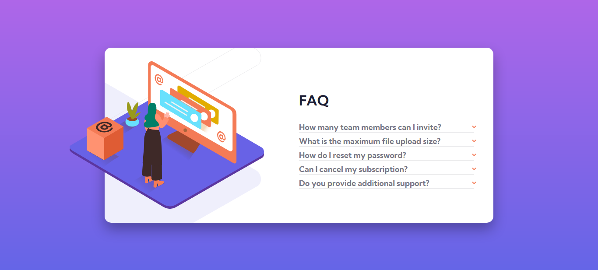
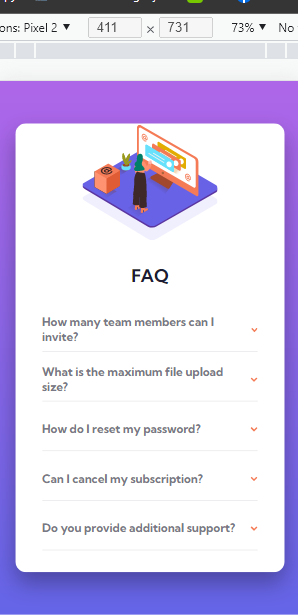
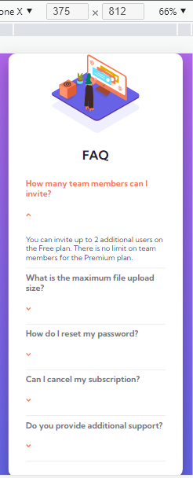
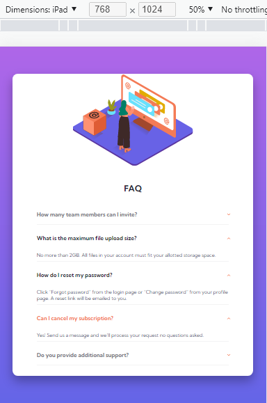

# Frontend Mentor - FAQ accordion card solution

This is a solution to the [FAQ accordion card challenge on Frontend Mentor](https://www.frontendmentor.io/challenges/faq-accordion-card-XlyjD0Oam). Frontend Mentor challenges help you improve your coding skills by building realistic projects. 

## Table of contents

- [Overview](#overview)
  - [The challenge](#the-challenge)
  - [Screenshot](#screenshot)
  - [Built with](#built-with)
  - [What I learned](#what-i-learned)
- [Author](#author)
- [Acknowledgments](#acknowledgments)

## Overview
This is a simple solution to the FAQ accordion card challenge on Frontend Mentor. 

### The challenge

Users should be able to:

- View the optimal layout for the component depending on their device's screen size
- See hover states for all interactive elements on the page
- Hide/Show the answer to a question when the question is clicked

### Screenshot

#### Desktop / Laptop


#### Mobile 1


#### Mobile 2


#### Mobile 3



### Links

- Solution URL: [Add solution URL here](www.github.com/Gustavo-Victor/faq-accordion-card)
- Challenge: [Add Challenge URL](https://www.frontendmentor.io/challenges/faq-accordion-card-XlyjD0Oam)


### Built with

- Semantic HTML5 markup
- CSS custom properties
- Flexbox
- Pure JavaScript

### What I learned

I learned a little more about javascript, css flexbox, item placement in css and semantics with html

#### Some code snippets:

```html
<!--main title-->
<h1 class="main-title">faq</h1>
```

```css
/*main*/
main{
    width: 65%;
    min-height: 400px;
    background-color: white;
    border-radius: 15px; 
    display: flex;
    flex-direction: row;
    align-items: center;
    box-shadow: 0px 15px 30px rgba(0,0,0,0.3);    
    background-image: url('./images/bg-pattern-desktop.svg');
    background-repeat: no-repeat;
    background-position: left -530px top -320px;
    background-size: 100%;
    background-origin: border-box;    
}
```

```js
//object
const faq = {
    //atribute
    items: window.document.querySelectorAll('.items .item'),

    //method
    openOrClose(){
        this.items.forEach(element => {
            element.addEventListener('click', () => {
                element.classList.toggle('active');
            })
        });
    }
}
//call method
faq.openOrClose();

}
```

If you want more help with writing markdown, we'd recommend checking out [The Markdown Guide](https://www.markdownguide.org/) to learn more.


## Author

- GitHub - [@Gustavo-Victor](https://github.com/Gustavo-Victor)
- Frontend Mentor - [@Gustavo-Victor](https://www.frontendmentor.io/profile/Gustavo-Victor)
- CodePen - [@gustavo_victor](https://codepen.io/gustavo_victor)
- Linkedin - [@gustavo-victor](https://www.linkedin.com/in/gustavo-victor-575b93206/)


## Acknowledgments

I would like to thank the twins (Ricardo and Roberto) as this project was based on their youtube lives. 

